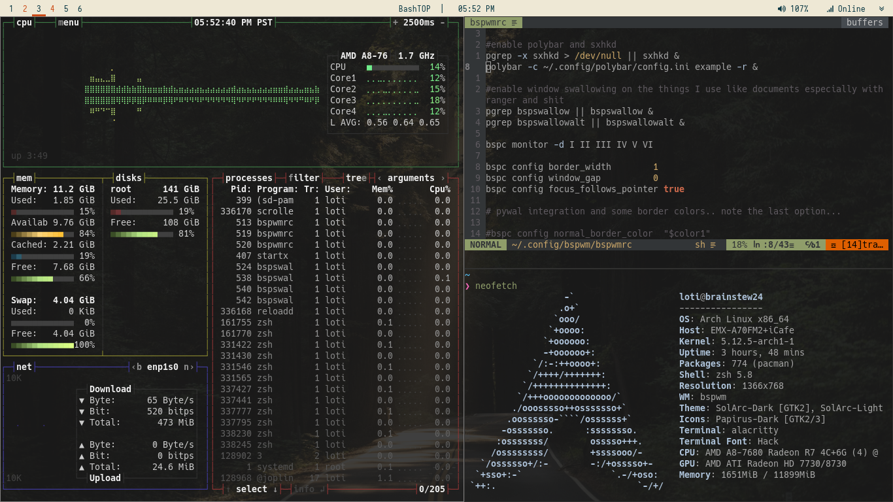
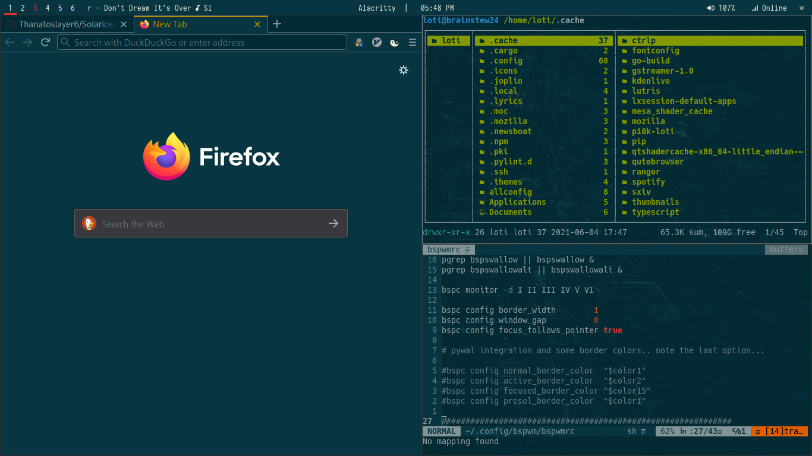

# Solariced-bspwm
## Screenshots

# Apps
- **Terminal emulator** : Alacritty
- **Web Browser** : Qutebrowser and Firefox
- **File Manager** : Ranger 
- **Editor** : Neovim
- **Application launcher** : rofi 

# Utilities
- **WM - BSPWM**
- **Shell**: zsh (Zsh-syntax-highlighting, Powerlevel10k, Zsh-autosuggestions) some from AUR

### Bar: Polybar
* **System tray**: stalonetray
* **Music**: playerctl-scroller

### Others
- **Notification daemon**: Dunst
- **Keybinding mapper**: sxhkd
- **Wallpaper setter**: feh 
- **Compositor**: picom-git *no configuration done... just install it lol

### Themes
- **Neovim and Alacritty**: Solarized-dark at night and Solarized-light at day // changes on cronjob
- **BSPWM and Polybar**: Xresources
* **Font**: Iosevka Nerd Font and Hack (for alacritty and polybar)
- **Gtk**: SolArc-Dark and SolArc-Lighter
- **Firefox**: Zen Fox extension

## Notes
### This repo is still not complete, as some stuff might not work especially some apps that are plugin dependent, so you might have to configure some stuff to your liking.

* Move bin directory to /usr/local/bin as some scripts might not work if scripts aren't located in 
$PATH.

## Dependencies
* [xgetres](https://github.com/tamirzb/xgetres) for Xresources import on dunst colors (needed)
* [mpDris2](https://github.com/eonpatapon/mpDris2) needed for mpd and other media playback to appear on polybar (needed)
* [Alacritty colorschemes](https://github.com/toggle-corp/alacritty-colorscheme) for neovim integration, this needs base16 vim plugin, check out the link (needed)
* [vim-plug](https://github.com/junegunn/vim-plug) for managing vim plugins (needed maybe)
* [playerctl-scroller](https://github.com/jan146/playerctl-scroller) for scrolling currently playing audio on polybar (already compiled in bin dir)
* [udiskie](https://github.com/coldfix/udiskie) for notifications on usb (not really needed just incase someone needs usb notifs on wms)

* The theme changes based on the hour of the day, which means you need to edit the **dynamic.sh** file inside bin dir, based on your preference. Also I suggest you put it in a cronjob
